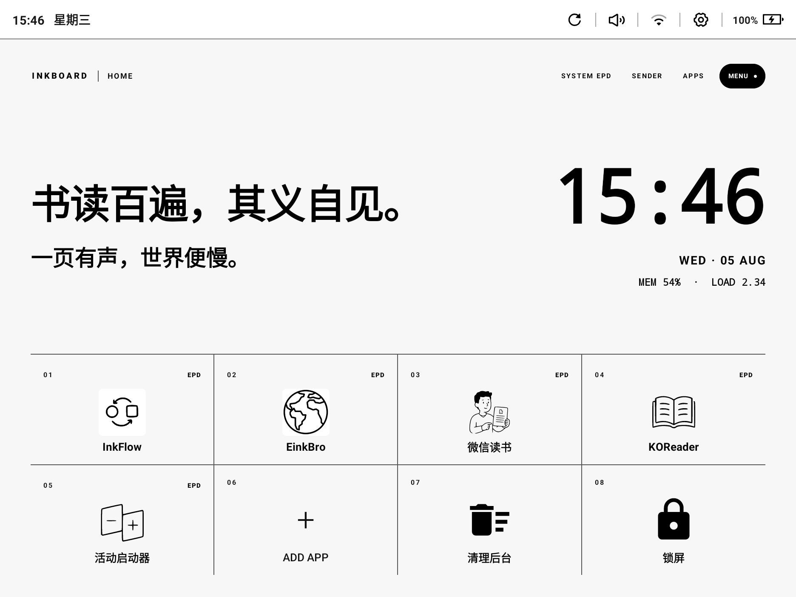
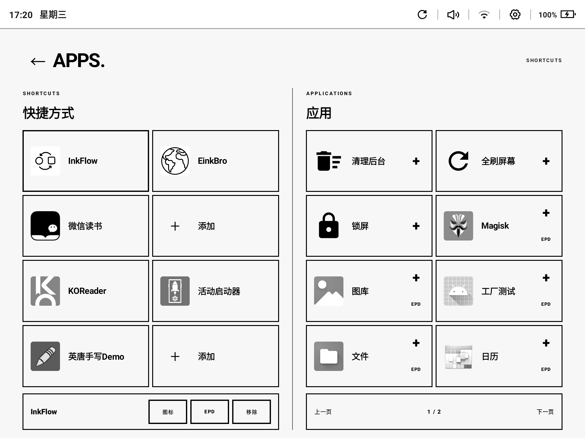
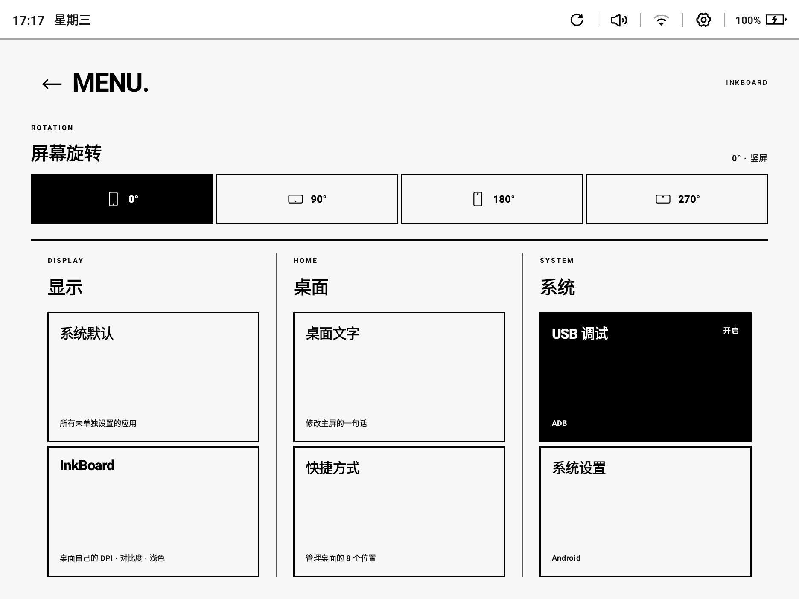
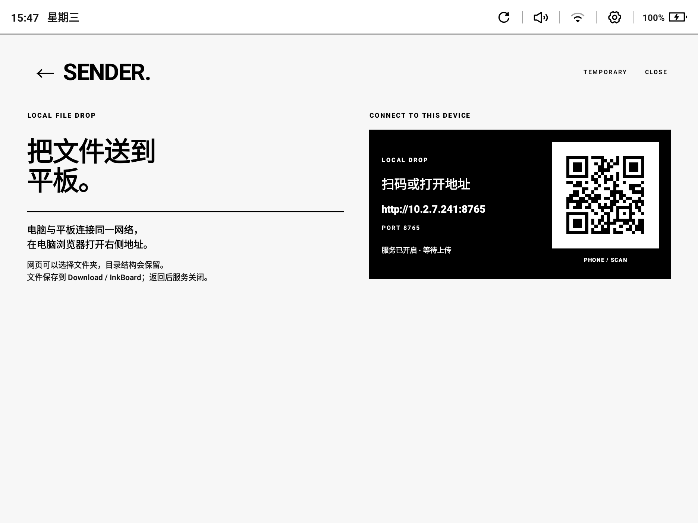
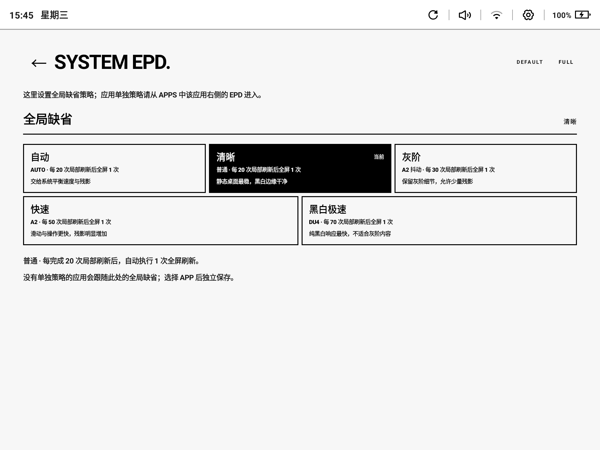

# InkBoard

[](https://github.com/kuaner/inkBoard/actions/workflows/android-release.yml)
[](https://github.com/kuaner/inkBoard/releases)

**给 Android 墨水屏平板用的 HOME 启动器。**

市面多数启动器为 LCD/OLED 设计：滚动、动画、灰阶阴影在电子纸上又慢又脏。InkBoard 反过来做——纯黑白、少动画、大触控、手动翻页，把常用应用钉在 8 个固定位置上，一按就开。

| | |
|--|--|
| **适用** | 任意 Android 墨水屏平板（文石、海信、掌阅、学习机等，能装 APK 即可） |
| **包名** | `ai.openduo.inkboard` |
| **下载** | [GitHub Releases](https://github.com/kuaner/inkBoard/releases) 签名 APK |

> 最初在云思智学 S11A（RK3566）上打磨；**核心桌面能力不依赖云思**。该系列额外提供 SYSTEM EPD / 每应用 EPD（见文末）。



---

## 为什么做这个

电子纸适合长时间阅读，不适合「手机式」桌面。常见痛点：

- 系统自带桌面信息杂、动画多、点一下全屏闪  
- 通用启动器堆卡片和半透明，残影难看得很  
- 想要的就几样：时间、一句话、几个常用 App、偶尔传个文件  

InkBoard 只做这些，并针对墨水屏交互收束：无涟漪、无惯性列表、黑白高对比。

---

## 功能（所有设备）

| 能力 | 说明 |
|------|------|
| 主屏 | 座右铭、大号时间/日期、内存与负载、**8 个快捷方式** |
| APPS | 管理槽位、加应用、换单色图标（Koboyo 内置，离线） |
| MENU | 旋转、改座右铭、快捷方式、ADB 开关入口、系统设置 |
| SENDER | 同网段浏览器上传文件/文件夹，返回即关，不常驻 |
| 内置工具 | 清理后台、全刷屏幕、锁屏（可钉到桌面） |





设为默认主屏幕后，按 Home / 电源回到 InkBoard；从其它应用回桌面会在稳定后尝试全刷一次（减少残影）。

---

## 安装

1. 从 [Releases](https://github.com/kuaner/inkBoard/releases) 下载最新 APK  
2. 开启 USB 调试，电脑安装 [platform-tools](https://developer.android.com/tools/releases/platform-tools)  
3. 执行：

```bash
adb install -r InkBoard-vX.Y.Z.apk
adb shell appops set ai.openduo.inkboard WRITE_SETTINGS allow   # 旋转需要
adb shell am start -n ai.openduo.inkboard/.MainActivity
```

4. 系统设置 → 默认应用 → 主屏幕 → **InkBoard**

**打开 ADB：**  
- 多数设备：设置 → 关于本机 → 连点版本号 → 开发者选项 → USB 调试  
- **云思智学**：设置 → 我的设备 → 序列号 7 次 → logo 7 次 →「我的设备」3 次（不要用「点版本号」那套）

---

## 安装（给 AI Agent）

复制整段给 Agent。**不要本地编译**，用 Release APK + adb。

```text
为 InkBoard（包名 ai.openduo.inkboard）安装并完成首次配置。

原则：
- 用 GitHub Release 的 APK（用户给路径，或下最新 Release 的 .apk）；禁止 ./gradlew，除非用户要求
- 先 adb devices；没有设备再引导开 ADB
- 开 ADB 必须先判机型：云思智学 → A1；其它/不确定 → A2。禁止对非云思机硬套序列号连点

A. 开 USB 调试
【云思】A1：设置→我的设备→序列号×7→logo×7→我的设备×3
【其它】A2：设置→关于本机→版本号×7→开发者选项→USB 调试→允许这台电脑
然后：adb devices（需为 device；unauthorized 则让用户点允许）

B. 安装
adb install -r <APK>
adb shell appops set ai.openduo.inkboard WRITE_SETTINGS allow
adb shell am start -n ai.openduo.inkboard/.MainActivity
提示用户：设置→默认应用→主屏幕→InkBoard

C. 仅云思（S11A / EB1004P 等）再执行
adb shell setprop persist.modify.eink.mode true
（非云思跳过。App 不会偷偷 setprop；EPD 入口会自动隐藏）

回报：机型判定、A1/A2、devices、install、WRITE_SETTINGS、（云思）eink.mode。
```

---

## 云思系列额外能力（可选）

仅在识别为云思 S11A / EB1004P 等且存在系统 EPD Provider 时显示入口；**其它机器完全不受影响**。



- **SYSTEM EPD**：全局刷新策略（自动 / 清晰 / 灰阶 / 快速 / 黑白极速等）  
- **每应用 EPD**：APPS 里应用旁进入，可调刷新、DPI、对比度、浅色处理  
- 配置写入系统 SystemUI EPD 表；前台切换波形还需一次：

```bash
adb shell setprop persist.modify.eink.mode true
```

出厂多为 `false`：能写配置但不换波形。InkBoard **不会**在应用内执行 `setprop`。

波形字段与 Provider 细节见 [docs/EPD_S11A.md](docs/EPD_S11A.md)。

ADB / 手势 / 待机与开关机图 / logo 分区 / Loader 刷机见 [docs/S11A_TUNING.md](docs/S11A_TUNING.md)。

**参考验证机**：云思智学 S11A（EB1004P）、RK3566、Android 11、1404×1872。

---

## 发布

推送标签 `v*`（须等于 `app/build.gradle.kts` 的 `versionName`，如 `v1.0.2`）会签名构建并创建 [GitHub Release](https://github.com/kuaner/inkBoard/releases)。`main` 推送不发版。

```bash
git tag v1.0.2 && git push origin v1.0.2
```

Secrets：`ANDROID_KEYSTORE_*`（与 [InkFlow](https://github.com/kuaner/inkflow) 共用证书命名）。

---

## 文档

| 文档 | 内容 |
|------|------|
| [docs/ARCHITECTURE.md](docs/ARCHITECTURE.md) | 模块与状态流 |
| [docs/INKBOARD_UI.md](docs/INKBOARD_UI.md) | 黑白 UI / 墨水屏交互 |
| [docs/EPD_S11A.md](docs/EPD_S11A.md) | 云思 EPD 刷新模式与 Provider |
| [docs/S11A_TUNING.md](docs/S11A_TUNING.md) | S11A 调优：ADB、刷机、待机/关机图、logo |
| [AGENTS.md](AGENTS.md) | 协作者 / Agent 工程约定 |

截图：`docs/images/`。
