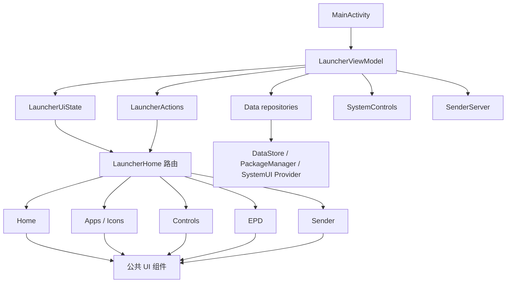

# InkBoard 重构后的项目架构

最后更新：2026-08-05

这份文档说明当前代码的职责边界、状态流和后续维护方式。重构的目标不是增加抽象层数量，而是让一个功能只在一个地方负责，让墨水屏交互、系统控制和厂商 EPD 适配彼此隔离。

## 重构结果

原来的 `LauncherHome.kt` 同时包含主页、菜单、应用抽屉、图标选择、EPD、Sender 和所有公共控件，超过 3000 行。现在它只保留页面路由和页面级状态；功能页面已按领域拆开，最大的 EPD 页面也拆成系统默认页、应用配置页和 EPD 公共组件。

当前结构如下：

```text
ai.openduo.inkboard
├── MainActivity.kt                 Android 入口，只负责生命周期与 Compose 挂载
├── LauncherViewModel.kt            状态协调者，不包含 Compose UI
├── LauncherUiState.kt              Compose 使用的只读状态模型
├── data/
│   ├── AppRepository.kt             PackageManager 应用发现与启动
│   ├── PreferencesRepository.kt     DataStore：快捷方式、文字、默认归属
│   ├── EpdSettingsRepository.kt     SystemUI EPD Provider 读写与激活
│   ├── KoboyoIconRepository.kt      离线 Koboyo 图标目录（assets 预置）
│   └── AppInfo.kt                   应用与内置快捷方式模型
├── ui/
│   ├── LauncherActions.kt           页面到 ViewModel 的意图/回调契约
│   ├── components/
│   │   ├── InkComponents.kt         单色图标、SVG、无涟漪点击
│   │   └── UiPrimitives.kt          页面框架、页眉、分页、应用图标、线条
│   ├── home/
│   │   ├── LauncherHome.kt          页面路由与页面级导航状态
│   │   ├── HomeScreen.kt            主页、时钟、8 槽位网格
│   │   └── MottoEditor.kt           主页文字编辑
│   ├── apps/AppDrawerScreen.kt      应用抽屉与快捷方式管理
│   ├── icons/IconPickerScreen.kt    分类、二级分类、手动翻页和图标选择
│   ├── controls/ControlScreen.kt    旋转、ADB、系统设置和桌面控制
│   ├── epd/
│   │   ├── EpdModels.kt             EPD 页面目标与标签模型
│   │   ├── EpdSystemScreen.kt       系统缺省刷新策略
│   │   ├── EpdProfileScreen.kt      应用/InkBoard 单独策略
│   │   └── EpdComponents.kt         EPD 标题与说明组件
│   ├── sender/SenderScreen.kt       Sender 平板端页面和二维码
│   └── theme/                       黑白颜色、字体和系统栏
├── util/
│   ├── SystemControls.kt            设备旋转、ADB、锁屏、清理后台等平台调用
│   ├── SenderServer.kt               一次性 HTTP 服务、分片上传与发布
│   └── SenderWebPage.kt              Sender 浏览器端 HTML/CSS/JS
└── admin/                            设备管理员接收器
```

## 状态与依赖方向



依赖规则是单向的：

- 页面只读 `LauncherUiState`，通过 `LauncherActions` 发出意图；页面不直接访问 DataStore、PackageManager 或 EPD Provider。
- `LauncherViewModel` 负责把意图转成仓库/平台调用，并把结果合并回 StateFlow。
- `data` 只负责持久化和数据源适配；`util` 只负责 Android/厂商平台能力和临时传输服务。
- 公共 UI 放在 `ui/components`，功能页面可以使用它，但公共组件不能反向依赖某个具体页面。
- 页面导航集中在 `LauncherHome`。新增页面时只在这里增加一个路由状态和一个分支，不把业务代码塞回根文件。

## 一次用户操作的完整链路

例如在 APPS 中给应用修改 EPD：

1. `LauncherHome` 打开 `EpdProfilePage`，页面只接收目标应用和当前状态。
2. 用户修改控件，页面通过 `onProfileChange` 调用 `LauncherActions.onSaveEpdProfile`。
3. `LauncherViewModel.saveEpdProfile()` 通过 `EpdSettingsRepository` 写入 SystemUI 的 `EinkSettings`。
4. EPD 页即时显示草稿状态；如果目标是 InkBoard，离开页面后才执行激活，避免调参期间重建桌面窗口。
5. 普通应用的实际波形切换交给 Android framework/SystemUI 的前台应用链路。

## 各层应该放什么

### 页面层 `ui/*`

页面只处理布局、临时选择和用户操作。可以有 `rememberSaveable` 的分页、当前 tab、当前页面是否打开等 UI 状态，但不能在 Composable 中启动 socket、读 Provider 或写 DataStore。

墨水屏页面必须继续遵守：固定网格、手动翻页、无滚动、无涟漪、无持续动画、黑白高对比。加载时保留页面骨架和翻页控件。

### 状态层 `LauncherViewModel.kt` / `LauncherUiState.kt`

ViewModel 是协调者，不是第二个 Repository。新的功能状态应加入 `LauncherUiState`，新的用户意图应加入 `LauncherActions`，异步操作统一使用 `viewModelScope`，阻塞的 Provider、PackageManager 和文件操作放到 IO dispatcher。

如果一个功能的状态和副作用继续明显增长，应先提取一个 feature controller/use-case，再由 ViewModel 组合它的 StateFlow；不要把更多私有状态直接塞进 ViewModel。

### 数据与平台层

- 应用列表和启动：`AppRepository`。
- 快捷方式、桌面文字和默认策略归属：`PreferencesRepository`。
- EPD Provider 字段、预置策略和应用/默认同步：`EpdSettingsRepository`。
- 图标目录与 SVG：`KoboyoIconRepository` 只读 `assets/koboyo/`（由 `scripts/download_koboyo_icons.py` 预下载，每类约 50 个，运行时不联网）。
- 旋转、ADB、锁屏、清理后台和系统设置：`SystemControls`。
- Sender 的 socket 生命周期、HTTP 请求、分片临时文件和 MediaStore 发布：`SenderServer`。
- Sender 网页源码单独放在 `SenderWebPage.kt`，修改网页样式不应触碰服务器生命周期代码。

## 新增功能的步骤

1. 先确定它属于哪个领域：主页、应用、控制、EPD、Sender 或数据/平台层。
2. 在对应 `ui/<feature>` 下新建页面文件；公共视觉行为放进 `ui/components`，不要复制一份页眉或分页器。
3. 在 `LauncherUiState` 增加只读状态，在 `LauncherActions` 增加用户意图。
4. 在 `LauncherViewModel` 中调用现有 Repository/平台适配器；需要新的外部能力时先新增适配器，再接入 ViewModel。
5. 在 `LauncherHome` 添加打开/返回路由，并为返回时会触发硬件副作用的功能明确退出时机。
6. 更新本文件和相关领域文档，然后执行编译、安装和设备回归。

## EPD 特别规则

EPD 的真实字段、刷新策略和 S11A 固件限制见 [EPD_S11A.md](EPD_S11A.md)。页面不应自行调用系统属性或复制一套 profile store；唯一配置链路是 `EpdSettingsRepository → SystemUI EPD Provider → framework`。

自定义 EPD 只在 **S11A / EB1004P** 产品线上启用，判断收敛为两层，避免到处 `if (epdEnabled)`：

1. **探测（一次）**：`EpdCapability.probe` 看设备标识 + SystemUI EPD Provider，结果按探测版本写入 DataStore。
2. **使用**：
   - 数据层：`EpdSettingsRepository(isEnabled = …)` 在关闭时全部 no-op。
   - UI 层：只在 `LauncherHome` 组装 `EpdEntryPoints`；子页面只认可选回调是否为 null，不再读产品开关。

默认刷新策略是 InkBoard 维护的“跟随默认应用集合”，不是一个虚构的常驻系统服务。改变默认策略时由 ViewModel 同步跟随默认的应用；独立应用不会被覆盖。

即时全刷仍走 `EpdSettingsRepository.requestFullRefresh()` 的 `EinkManager.sendOneFullFrame()`；
默认 HOME 返回由 `MainActivity` 在桌面恢复后触发一次，手动入口则作为 `BuiltInShortcut.FULL_REFRESH`
出现在 APPS 的内置工具中，避免页面层直接碰厂商服务。

## 验证清单

每次涉及架构或页面行为的改动至少执行：

```bash
./gradlew :app:assembleDebug
adb install -r app/build/outputs/apk/debug/app-debug.apk
```

设备回归重点检查：主页、MENU、APPS 手动翻页、图标分页加载状态、系统/应用 EPD 页面、Sender 启停和二维码地址。EPD 相关修改还要确认离开 InkBoard 自身 EPD 页面后才发生激活，避免桌面长时间无响应。

当前没有独立的单元测试模块；Provider 和墨水屏波形行为必须以 S11A 真机验证，不能用普通 Android 模拟器结果代替。
